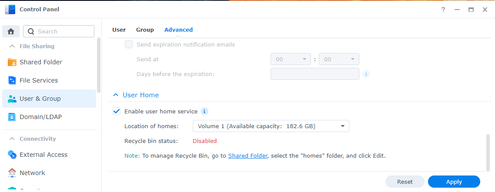
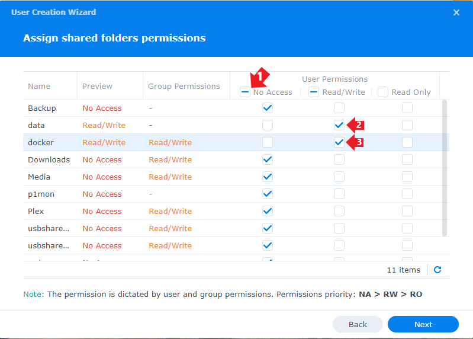
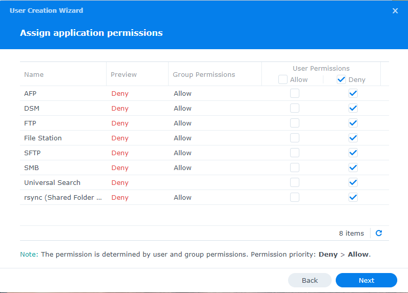

# Synology

!!! note

    Being I don't have a Synology myself and I kind of hate the Synology GUI for the dockers, we're going to do this with the use of docker-compose through a terminal.

    This is faster than the GUI and after installing, it shows up in the Docker GUI.

    Thanks to faxity for the initial compose that I used to create the Synology Guide.

    And a very big thanks to [Bokkoman](https://www.buymeacoffee.com/bokkoman){:target="_blank" rel="noopener noreferrer"} and [BZwart](https://github.com/BaukeZwart){:target="_blank" rel="noopener noreferrer"} that updated this Guide for DSM 7 and also offered their help on discord as Synology Support Team.

## Introduction

This page will provide you with guidance on how to install several Docker images related to the Servarr apps to your Synology. We highly recommend reading the full guide, that way you have a better understanding of what you do, in case you later decide to make changes.

## Summary

1. We will create **_one_** share that will hold all your data. This ensures hardlinking and/or instant moves are possible.
1. Create one user that will be assigned to the docker images as the user they run out of security reasons.
1. Create a folder structure on the `data` and `docker` share with a few commands (or manually).
1. Download and edit the `docker-compose.yml` and `.env` files to your system settings.
1. Set permissions to all folders related to the shares.
1. Run and execute docker commands to start the containers.

### Automated Script

??? example "Automated script (**:bangbang:Use this script at your own risk:bangbang:**) - [Click to show/hide]"

    !!! Warning

        Though, we offer a short way out. This is intended as a quick way to do everything that is written on this page within one script. And is only for initial setup. After that, you need to manage it yourself. Rerunning the script can or will reset all personal changes made in the compose/env.

        The script is only tested on Synology DSM7 and higher.

        **:bangbang: We are not held liable if anything breaks on your system. Use at your own risk :bangbang:**

    To get this working you will need to enable terminal access (SSH) and home folders.

    Be sure to delete current running Docker containers related to this guide (ie. *arr apps, download clients), and backup settings before you do.

    To enable SSH on your Synology take a look [HERE](#ssh){:target="_blank" rel="noopener noreferrer"}.

    To enable Home folders, go to `Control Panel` > `User & Group` > `Advanced` > `Enable user home service` at the bottom.

    

    When you enable these two settings, run the following commands in your favorite terminal app and follow the onscreen questions.

    ```bash
    curl -sL git.io/syno-script > ~/syno-script
    ```

    ```bash
    sudo bash ~/syno-script
    ```

## Install Docker

You need to install Docker / Container Manager from the `Package Center`. This should also create a share named `docker`, and check File Station if it is present.

## Create the main share

We will create and use a new share named `data` (lowercase) for all your library media and downloads.

To create a new share:

`Control Panel` > `Shared Folder` > click `Create` > choose `Create Shared Folder`


Name this shared folder `data`. You can disable the trash can, up to you. Click next until you are done.

## Create a user

We are going to create a new user that only has access to the share(s) that we use for the containers to run. You should not have the containers run as an admin/root user.

Go to `Control Panel` > `User & Group`

In the `User` section, create a new user. Name it whatever you like, but for this guide, we will use the name `docker`.


Fill out the rest of the information, generate a password or type your own.

Click next, you will now be able to select which group this user will belong to, it should only be the group `users`. Click `Next`.

### Assign shared folder permissions

In the next screen, you will be able to select which Shares this user will have access to, click `No Access` on the top, this will deny all access.

Now **only** select `Read/Write` on the shares `docker` and `data` (the share we created earlier).



Click `Next` until you reach `Assign application permissions`

### Assign application permissions

In this screen, you will be able to select which application this user will have access to. Check `Deny` for all applications.



Continue to click `Next` until you are finished.

## SSH

You are mostly going to use the terminal. Some parts will need the Synology web GUI.
To enable terminal access, you need to enable SSH in the Synology Settings.

`Control Panel` > `Terminal & SNMP` > `Enable SSH service`


Then use a program like [Putty](https://www.putty.org/){:target="\_blank" rel="noopener noreferrer"} or Powershell/Terminal to SSH into your Synology.

Enter the login information of a Synology user account that has admin privileges, as only members of the 'administrators' user group can use SSH.

If you get a message asking if you want to trust the key, just press `OK` or `ACCEPT`.

### PUID and PGID

For the Docker container to access the shares on Synology, we need to know the user ID (PUID) and group ID (PGID) from the `docker` user we just created.

Once logged in to the terminal type `id docker`. If you used a different username, change `docker` to the one you used.


This will show you the UID (aka PUID).
In the screenshot above this is `1035` for the docker user and `100` is the GID (aka PGID) for the user's group.
Save these values for later use.

## Create Folder Structure

Let's create a good folder structure on the shares we use (`docker` and `data`). This will be done with a few commands.

The structure will look like this. You can of course edit this, but do this when you know what you are doing.
_We are using lowercase on all folders on purpose, being Linux is case-sensitive._

{! include-markdown "../../../includes/hardlinks/docker-tree-full.md" !}

{! include-markdown "../../../includes/hardlinks/bad-path-suggestion.md" !}

To create the folder structure for your media library and also for your preferred download client, run one or both of the following commands:

### If you use usenet

```bash
mkdir -p /volume1/data/{usenet/{incomplete,complete}/{tv,movies,music},media/{tv,movies,music}}
```

### If you use torrents

```bash
mkdir -p /volume1/data/{torrents/{tv,movies,music},media/{tv,movies,music}}
```

---

### Appdata

Your application data will be stored in the `docker` share in the folder called `appdata` (`/volume1/docker/appdata`)
Create these folders with the command below, or create them in File Station manually.

```bash
mkdir -p /volume1/docker/appdata/{radarr,sonarr,bazarr,plex,prowlarr,pullio}
```

You can add your own subfolders for your download client(s) using the command above, by adding the name to the command.

So your appdata folder will look like this.

```none
docker
└── appdata
    ├── radarr
    ├── sonarr
    ├── bazarr
    ├── plex
    ├── prowlarr
    ├── pullio
    ├── (your download client, i.e. nzbget; sabnzbd; qbittorrent)
    └── (other applications)
```

---

## Needed files

Now we are ready to move to the installation of containers.

For this, we need two files:

1. `docker-compose.yml`
1. `.env`

We will start by downloading the `docker-compose.yml` file

Download this [docker-compose.yml](https://raw.githubusercontent.com/TRaSH-/Guides-Synology-Templates/main/docker-compose/docker-compose.yml){:target="\_blank" rel="noopener noreferrer"} to your `/volume1/docker/appdata` location so you can get your important stuff together. Or use the command below:

```bash
wget https://raw.githubusercontent.com/TRaSH-/Guides-Synology-Templates/main/docker-compose/docker-compose.yml -P /volume1/docker/appdata/
```

### What's included in the compose and what is not included

This docker-compose file will have the following docker containers included.

```none
    - Radarr
    - Sonarr
    - Bazarr (Subtitle searcher and downloader)
    - Plex
    - Prowlarr (indexer/tracker manager)
```

What's not included (and where are the download clients?).

We didn't add a download client to it, because it depends on what you prefer (usenet/torrent) and which client you prefer. We have a repository [Repository](https://github.com/TRaSH-/Guides-Synology-Templates/tree/main/templates){:target="\_blank" rel="noopener noreferrer"} on Github where we provide and maintain some templates that are ready to use with the main `docker-compose.yml`.

The only thing you need to do is copy & paste what's inside the template file into the main `docker-compose.yml` on the bottom, the templates also have a command that you need to use to create the [appdata](#appdata) folder that we explained earlier. Without the appdata folder for the application, the creation of the container will fail because of the missing folder.

Second, we will download the `.env` file

Download this [.env](https://raw.githubusercontent.com/TRaSH-/Guides-Synology-Templates/main/docker-compose/.env){:target="\_blank" rel="noopener noreferrer"} to your `/volume1/docker/appdata` location next to the `docker-compose.yml`. Or use this command:

```bash
wget https://raw.githubusercontent.com/TRaSH-/Guides-Synology-Templates/main/docker-compose/.env -P /volume1/docker/appdata/
```

!!! warning

    :bangbang: MAKE SURE THE FILE KEEPS THE ORIGINAL NAME `.env` WITH THE DOT BEFORE IT :bangbang:

---

### Changes and preparations

!!! tip

    If you need to edit docker-compose.yml or the .env file we advise to use [Notepad++](https://notepad-plus-plus.org/){:target="\_blank" rel="noopener noreferrer"} or [Visual Studio Code](https://code.visualstudio.com/){:target="\_blank" rel="noopener noreferrer"}

The `.env` file we downloaded holds the variables/information you need to change for everything to work. I added explanations in the `.env` file.

1. DOCKERCONFDIR (only change this if you know what you're doing and decide to use another path than this guide used)
1. DOCKERDATADIR (only change this if you know what you're doing and decide to use another path than this guide used)
1. PUID/PGID (this info you got earlier from [HERE](#puid-and-pgid))
1. TZ (Change to your timezone, can be found [HERE](https://en.wikipedia.org/wiki/List_of_tz_database_time_zones){:target="\_blank" rel="noopener noreferrer"})
1. Install and Create a task scheduler for Pullio, so your containers stay up to date.

!!! info ""

    The `.env` holds more variables/information for other containers you don't need to remove those variables and will be only used when you install the other containers.

---

#### Pullio - Auto update docker-compose the correct way

Pullio allows you to automatically update your containers. And send you a notification through various means. We use a Discord Webhook.

First, you need to download Pullio

```bash
    sudo curl -fsSL "https://raw.githubusercontent.com/hotio/pullio/master/pullio.sh" -o /usr/local/bin/pullio
```

```bash
    sudo chmod +x /usr/local/bin/pullio
```

For Pullio to do its job, you will need to create a Scheduled Task in your Task Scheduler that runs for example at 4AM with **root** privileges.

`Control Panel` > `Task Scheduler` > click `Create` > choose `Scheduled task - user-defined script`

Give the task a name so you know what it does. Choose user `root`.

In the `Schedule` tab choose when and how often you want it to check for updates.

At `Task Settings` tab, add the following line in the Run Command section:

```bash
/usr/local/bin/pullio > /volume1/docker/appdata/pullio/pullio.log 2>&1
```

It can be frustrating to test the script if no docker image updates are available, therefore you can run the command `sudo pullio` --debug` and the script will behave as if an update is available. If you have set to receive notifications, you should receive them.

More info about Pullio [HERE](https://hotio.dev/scripts/pullio/){:target="\_blank" rel="noopener noreferrer"}

---

### Permissions

Now we need to make sure that the newly created files and folders have the correct permissions.

If you have an existing library, it is advised to move these to the new `data` share prior to running the commands below.

!!! note

    If you're using a different user than `docker` (the user-generated in the beginning), then you need to change the `docker:users` part in the command below!!!

```bash
sudo chown -R docker:users /volume1/data /volume1/docker
```

```bash
sudo chmod -R a=,a+rX,u+w,g+w /volume1/data /volume1/docker
```

!!! note

    If you move files from a different library into the newly created library afterward, you need to rerun these commands. !!!

---

## Run the Docker Compose

!!! tip

    make sure you delete/remove all your existing dockers from the Docker GUI and also remove your native installs (in Package Center) of these applications !!!
    If you had previously installed apps, make a backup of their config folders or backup through the WebUI of the app.

If you have followed all the steps and your compose file is ready, run the following commands:

```bash
cd /volume1/docker/appdata
```

```bash
sudo docker-compose up -d
```

You will notice that all the images will be downloaded, and after that, the containers will be started. If you get an error then read what the error says and try to fix it (missing folders, permissions errors, etc). If you can't figure out the solution to your errors, join the guides-discord [here](https://trash-guides.info/discord){:target="\_blank" rel="noopener noreferrer"} and create a support ticket.

---

**If you need help setting up the applications, look at the [Examples](/File-and-Folder-Structure/Examples/) of how to set up the paths inside your applications.**

!!! warning

    If you need to make any changes, only edit the `docker-compose.yml` file. To activate the changes, [run the commands from here](#run-the-docker-compose) again.

    Any changes you do/did in the GUI will be reverted when you run the docker-compose command.

    Just don't use the GUI, only for information purposes !!!

{! include-markdown "../../../includes/hardlinks/docker-compose-commands.md" !}

--8<-- "includes/support.md"

---

## Additional Synology Info

### DSM Task for correctly reporting IP in Plex/Nginx/Etc

Due to some iptables configuration in DSM, you can get an incorrect IP reported in Plex or other apps that need an read/report the IP. To fix this, you need to add two rules to your iptables. unfortunately, those rules can sometimes be deleted at reboot or after DSM update.

To fix this, you will need to add a Scheduled Task that executes at boot as the root user which will check if the rules exist, and, if not - re-add them.

??? question "Task bash command - [Click to show/hide]"

    ```bash
    --8<-- "includes/hardlinks/docker-iptables-fix.sh"
    ```
